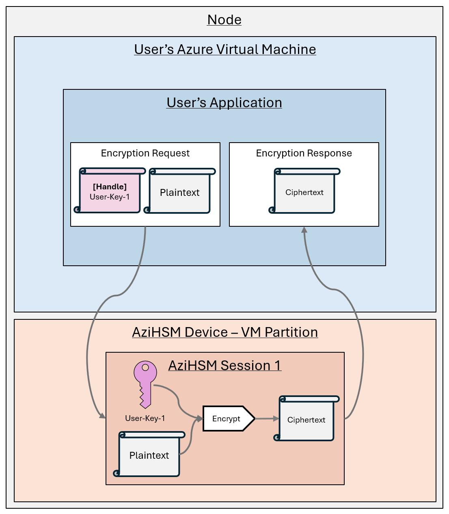

# Cryptographic Operations with AziHSM

AziHSM performs cryptographic operations *on-device*, meaning:

* The keys used to perform the crypto operation are stored on the local AziHSM device.
    * The keys *never* leave the AziHSM device in plaintext.

User applications on an Azure VM refers to keys by programmatic "handles" that reference the keys stored on the AziHSM device.
To perform a cryptographic operation:

1. A user application submits a request to the AziHSM device, providing input data and a key handle.
2. The AziHSM device receives the request, performs the operation with the key it is storing.
3. The AziHSM device packages the result of the crypto operation into a response and sends it back to the user application in the Azure VM.

### How do I put a key on the AziHSM device?

Please see these pages to learn how:

* [Secure Key Release](./SecureKeyRelease.md) - For importing a key you have stored in AKV/mHSM.
* [Key Import](./KeyImport.md) - For importing a key you have stored elsewhere, or locally on your VM.

