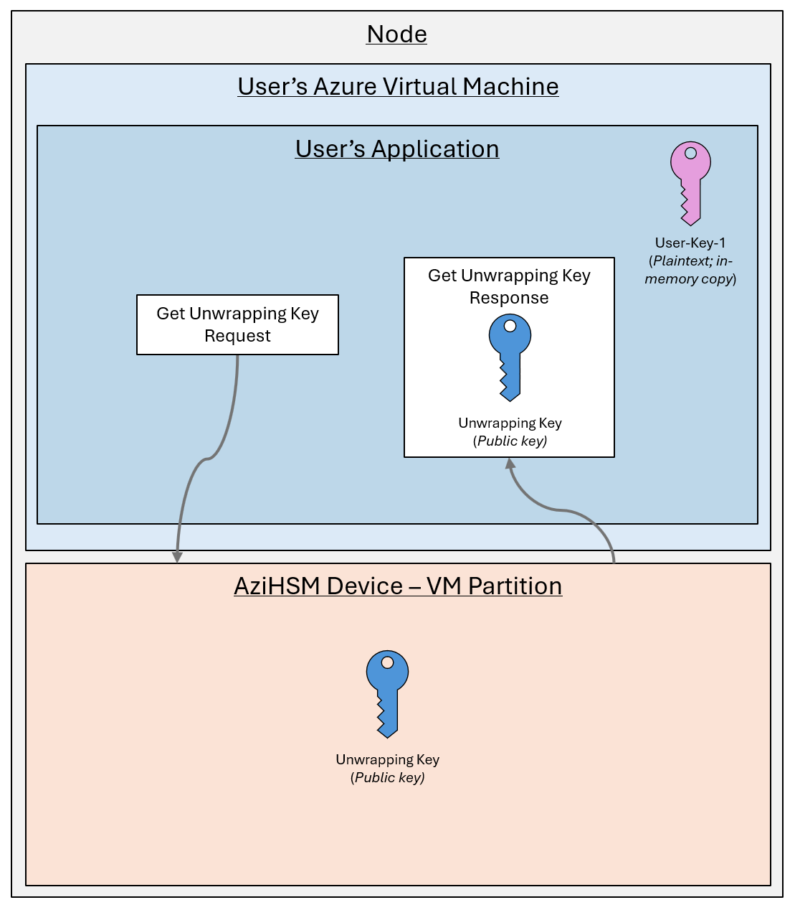
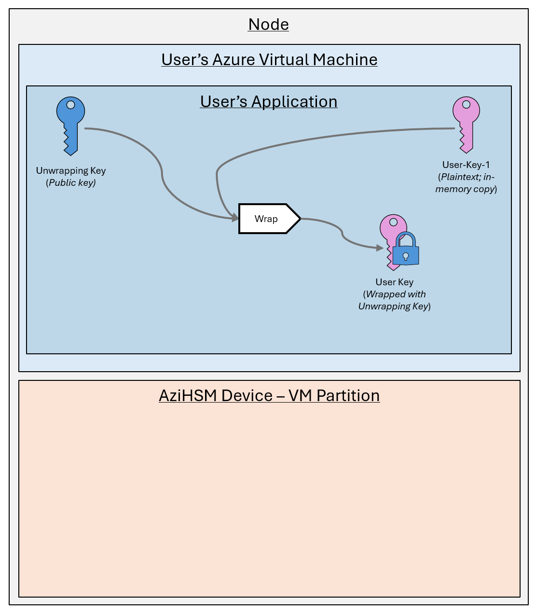
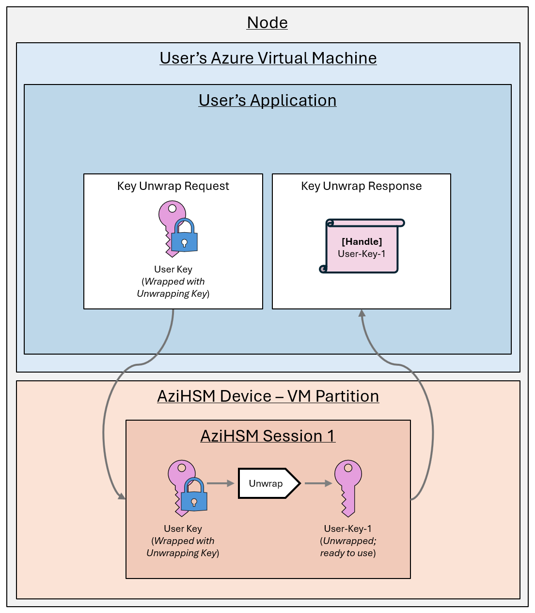

# AziHSM Key Unwrap & Import

However, AziHSM also supports importing keys directly from user-space in a VM.
This document describes the process of importing a local key into AziHSM.
[**Secure Key Release**](./SecureKeyRelease.md) (**SKR**) can alternatively be used to import keys into AziHSM from Azure key storage solutions, such as AKV/mHSM.

To see a sample application that implements this process, please see the [AziHSM sample applications](https://github.com/microsoft/AziHSM-Guest).

## Step 1 - Retrieving the AziHSM Unwrapping Key

Every AziHSM device generates an internal **unwrapping key**.
This key's sole purpose is to provide a public/private key pair that can be used for securely importing a key into the AziHSM device.

The guest application first opens a handle to the built-in unwrapping key, and then exports the *public key* bytes needed for wrapping.
(On Windows, you can open the key handle via the NCrypt API's [`NCryptOpenKey` function](https://learn.microsoft.com/en-us/windows/win32/api/ncrypt/nf-ncrypt-ncryptopenkey), then export the public key material using [`NCryptExportKey`](https://learn.microsoft.com/en-us/windows/win32/api/ncrypt/nf-ncrypt-ncryptexportkey).)

## Step 2 - Wrapping Your Key

Once the unwrapping key's public key half is retrieved, the guest application uses this to encrypt the user's key and prepare a **wrapped key blob**.
The encryption operations in this step are performed *on the VM* by an existing encryption APIs (such as BCrypt or OpenSSL).

The resulting **wrapped key blob** is then ready to be sent to the AziHSM device.

## Step 3 - Importing the Wrapped Key Blob into AziHSM

Finally, the wrapped key blob is sent to the device.
Because it has been wrapped, the user's key is protected while in-transit from the VM onto the AziHSM device.

Once received, the AziHSM device uses the *private key* half of its unwraping key to decrypt the blob.
As a result, the user's key is decrypted and stored in the AziHSM device, ready to be used for crypto operations.

