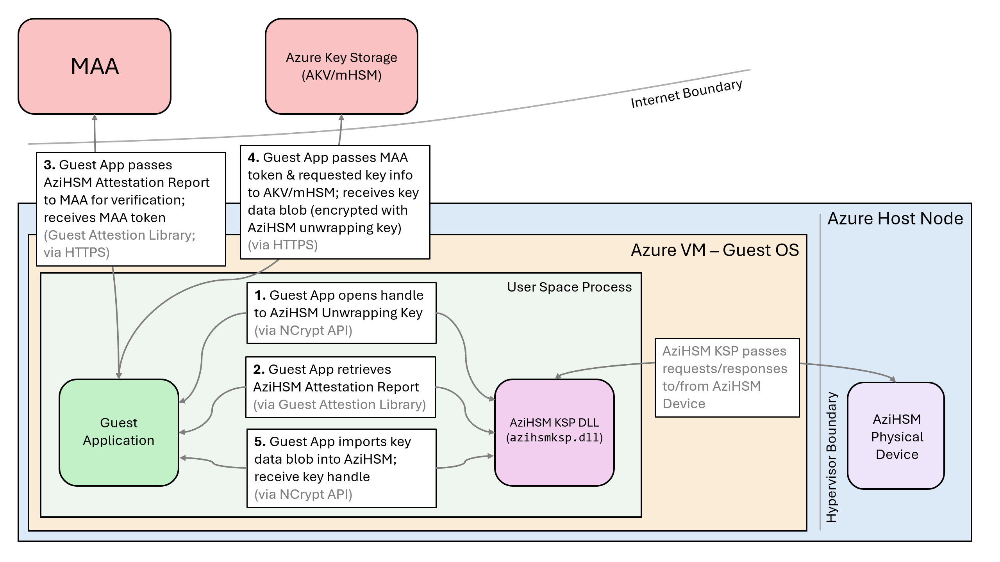

# AziHSM Secure Key Release

## Overview
**SKR**, or **Secure Key Release** is a functionality of Azure Key Vault (AKV) Managed HSM (mHSM).
It enables the releasing of a key protected within AKV/mHSM to a Trusted Execution Environment (TEE).
With an AziHSM-enabled VM, protected keys can be released from AKV/mHSM into the guest OS in the form of an encrypted key blob that can only be decrypted once it has been imported into the AziHSM isolated hardware TEE.
Customers using AziHSM can securely release a key directly into the AziHSM device such that it can be used for crypto operations without ever being exposed in plaintext during transit from AKV/mHSM into the AziHSM TEE.
See [this page](https://learn.microsoft.com/en-us/azure/confidential-computing/concept-skr-attestation) for more information on SKR and Azure Confidential Computing (ACC).

The AziHSM SKR process is illustrated in the diagram below, and the process is described below.
To see a sample application that implements this process, please see the [AziHSM sample applications](https://github.com/microsoft/AziHSM-Guest) on GitHub.

In the above diagram (and in the description below), the following terms are used:

* **Guest OS** - The operating system running within a customer's Azure VM.
* **Guest Application** - An application, developed by a customer, that runs on the guest OS.
* **User Space Process** - The Windows process that is executing the guest application.
* **AziHSM Device** - The physical AziHSM device that is installed onto the Azure host node upon which the guest OS is running.
* **AziHSM KSP DLL** - A Windows DLL (dynamic-link library) that, like other DLLs, is loaded into the address space of the guest application.
    * This DLL exposes an interface that enables the guest application to communicate with the AziHSM device by calling the [Windows NCrypt API](https://learn.microsoft.com/en-us/windows/win32/api/ncrypt/).
* **MAA** - [Microsoft Azure Attestation](https://learn.microsoft.com/en-us/azure/attestation/overview)
* **AKV/mHSM** - [Azure Key Vault](https://learn.microsoft.com/en-us/azure/key-vault/), [Managed HSM](https://learn.microsoft.com/en-us/azure/key-vault/managed-hsm)

### Step 1 - Opening the AziHSM Unwrapping Key Handle

Every AziHSM device generates an internal **built-in unwrapping key**.
This key's sole purpose is to provide a public/private key pair that can be used for securely importing a key into the AziHSM device.
The public key is used to encrypt a key's contents before sending it into the device.
Once the encrypted key blob is in the AziHSM device's memory space, the AziHSM uses its private key to unwrap it and store the key in its TEE.

The first step of SKR is to open a handle to this built-in unwrapping key.
A guest application running on the guest OS can do this via the NCrypt API's [`NCryptOpenKey` function](https://learn.microsoft.com/en-us/windows/win32/api/ncrypt/nf-ncrypt-ncryptopenkey).

### Step 2 - Getting the AziHSM Attestation Report

Once a handle to the AziHSM's built-in unwrapping key has been retrieved, the next step is to retrieve an **attestation report** for the key.
This data is used to attest and ensure that the AziHSM device the guest application is communicating with (and, by extension, the built-in unwrapping key) can be trusted.
A guest application can do this via the AziHSM Guest Attestation Library.

### Step 3 - Attesting the AziHSM Unwrapping Key

To perform attestation of the AziHSM built-in unwrapping key, the guest application next sends the attestation report to MAA (Microsoft Azure Attestation).
MAA verifies the report and issues a **MAA token** as proof of attestation.

### Step 4 - Releasing the Key from AKV/mHSM

The guest application then reaches out to AKV/mHSM via HTTPS, providing the following information:

* The MAA token
* Information on the requested key
* Access token (for authentication)

AKV/mHSM encrypts the contents of the requested key with the AziHSM built-in unwrapping key (the public key).
This encrypted key blob is then returned to the guest application.

(Note: due to the nature of the public/private key pair, the encrypted key blob cannot be decrypted by *anyone* while in transit, or even on the guest OS.
It can only be decrypted by the AziHSM once the key blob has reached the device.
In this way, the key released from AKV/mHSM is protected from any MITM (man-in-the-middle) and side-channel attacks.)

### Step 5 - Importing the Key Blob into AziHSM

The final step is to import the encrypted key blob that was released by AKV/mHSM into the AziHSM Device.
The guest application calls the [`NCryptImportKey` function](https://learn.microsoft.com/en-us/windows/win32/api/ncrypt/nf-ncrypt-ncryptimportkey), which passes the encrypted key blob into the physical AziHSM device.

## Secure Key Release in code

See [SECURE-KEY-RELEASE Sample](../samples/cpp/SECURE-KEY-RELEASE/README.md) for code references.
